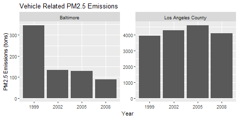

# EPA National Emissions Inventory
## Graphing Analysis Exercise in R
### John Hopkins University - Exploratory Data Analysis

#### Introduction

Fine particulate matter (PM2.5) is an ambient air pollutant for which there is strong evidence that it is harmful to human health. In the United States, the Environmental Protection Agency (EPA) is tasked with setting national ambient air quality standards for fine PM and for tracking the emissions of this pollutant into the atmosphere. Approximatly every 3 years, the EPA releases its database on emissions of PM2.5. This database is known as the National Emissions Inventory (NEI). You can read more information about the NEI at the [EPA National Emissions Inventory](http://www.epa.gov/ttn/chief/eiinformation.html) web site.

#### Data

[PM2.5 Emissions Data](./data/raw/summarySCC_PM25.rds): This file contains a data frame with all of the PM2.5 emissions data for 1999, 2002, 2005, and 2008. For each year, the table contains number of tons of PM2.5 emitted from a specific type of source for the entire year. 

- **fips**: A five-digit number (represented as a string) indicating the U.S. county

- **SCC**: The name of the source as indicated by a digit string (see source code classification table)

- **Pollutant**: A string indicating the pollutant

- **Emissions**: Amount of PM2.5 emitted, in tons

- **type**: The type of source (point, non-point, on-road, or non-road)

- **year**: The year of emissions recorded

[Source Classification Code Table](./data/raw/Source_Classification_Code.rds): This table provides a mapping from the SCC digit strings in the Emissions table to the actual name of the PM2.5 source. The sources are categorized in a few different ways from more general to more specific and you may choose to explore whatever categories you think are most useful. 

For example, source “10100101” is known as “Ext Comb /Electric Gen /Anthracite Coal /Pulverized Coal”.

You can read each of the two files using the `readRDS()` function in R. For example, reading in each file can be done with the following code:

    NEI <- readRDS("./data/raw/summarySCC_PM25.rds")
    SCC <- readRDS("./data/raw/Source_Classification_Code.rds")

#### Questions

You must address the following questions and tasks in your exploratory analysis. For each question/task you will need to make a single plot. Unless specified, you can use any plotting system in R to make your plot.

1. Have total emissions from PM2.5 decreased in the United States from 1999 to 2008? Using the base plotting system, make a plot showing the total PM2.5 emission from all sources for each of the years 1999, 2002, 2005, and 2008.

	library(dplyr)

	# Read the data
	NEI <- readRDS("./data/raw/summarySCC_PM25.rds")

	# calculate total PM2.5 for each year (convert ton to megaton)
	total_PM2.5_by_year <- NEI %>% 
	  group_by(year) %>% 
	  summarise(total=sum(Emissions)/1e+06)

	# use base bar plot, output to png
	png('plot1.png', width = 480, height = 480)

	with(total_PM2.5_by_year,
	     barplot(height=total, 
		     names.arg=year,
		     ylab = "PM2.5 emitted (megatons)",
		     main = "US total PM2.5 emission from all sources"
		     )
	)

	dev.off()

2. Have total emissions from PM2.5 decreased in the Baltimore City, Maryland (fips == "24510") from 1999 to 2008? Use the base plotting system to make a plot answering this question.

	library(dplyr)

	# Read the data
	NEI <- readRDS("./data/raw/summarySCC_PM25.rds")

	# calculate total PM2.5 for each year for Baltimore
	total_PM2.5_by_year <- NEI %>% 
	  filter(fips == "24510") %>%
	  group_by(year) %>% 
	  summarise(total=sum(Emissions))

	# use base bar plot, output to png
	png('plot2.png', width = 480, height = 480) 

	with(total_PM2.5_by_year,
	     barplot(height=total, 
		     names.arg=year,
		     ylab = "PM2.5 emitted (tons)",
		     main = "Baltimore total PM2.5 emission from all sources"
	     )
	)

	dev.off()

3. Of the four types of sources indicated by the type (point, nonpoint, onroad, nonroad) variable, which of these four sources have seen decreases in emissions from 1999–2008 for Baltimore City? Which have seen increases in emissions from 1999–2008? Use the ggplot2 plotting system to make a plot answer this question.

	library(dplyr)
	library(ggplot2)

	# Read the data
	NEI <- readRDS("./data/raw/summarySCC_PM25.rds")

	# calculate total PM2.5 for each source type by year for Baltimore
	total_PM2.5_by_year <- NEI %>% 
	  filter(fips == "24510") %>%
	  group_by(year, type) %>% 
	  summarise(total=sum(Emissions))

	# use ggplot col graph, grid 2 wide, graphs grouped by type, each graph own scale
	# output to png
	png('plot3.png', width = 480, height = 480)

	ggplot(total_PM2.5_by_year, aes(as.factor(year), total)) +
	  facet_wrap(. ~ type, ncol = 2, scales="free") +
	  geom_col() +
	  labs(title = "Baltimore Total PM2.5 Emissions by Source Type") +
	  labs(x = "Year", y = "PM2.5 Emissions (tons)")

	dev.off()

4. Across the United States, how have emissions from coal combustion-related sources changed from 1999–2008?

	library(dplyr)

	# Read the data
	NEI <- readRDS("./data/raw/summarySCC_PM25.rds")
	SCC <- readRDS("./data/raw/Source_Classification_Code.rds")

	# Find all SCC codes from any of the coal sectors
	sccCoal <- subset(SCC, grepl('coal',EI.Sector, ignore.case = T), SCC)

	# calculate total  US PM2.5 for each year (convert ton to kiloton) for
	# coal related sources
	total_PM2.5_by_year <- NEI %>% 
	  filter(SCC %in% sccCoal$SCC) %>%
	  group_by(year) %>% 
	  summarise(total=sum(Emissions)/1e+03)

	# use base bar plot, output to png
	png('plot4.png', width = 480, height = 480)

	with(total_PM2.5_by_year,
	     barplot(height=total, 
		     names.arg=year,
		     ylab = "PM2.5 emitted (kilotons)",
		     main = "US Total PM2.5 Emissions from \nCoal Related Sources"
	     )
	)

	dev.off()

5. How have emissions from motor vehicle sources changed from 1999–2008 in Baltimore City?

    library(dplyr)

    # Read the data
    NEI <- readRDS("./data/raw/summarySCC_PM25.rds")
    SCC <- readRDS("./data/raw/Source_Classification_Code.rds")

    # Find all SCC codes from any of the coal sectors
    sccVehicle <- subset(SCC, grepl('vehicle',EI.Sector, ignore.case = T), SCC)

    # calculate total  US PM2.5 for each year (convert ton to kiloton) for
    # vehicle related sources for Baltimore only
    total_PM2.5_by_year <- NEI %>% 
    filter(SCC %in% sccVehicle$SCC, fips == "24510") %>%
    group_by(year) %>% 
    summarise(total=sum(Emissions))

    # use base bar plot, output to png
    png('plot5.png', width = 480, height = 480)

    with(total_PM2.5_by_year,
        barplot(height=total, 
                names.arg=year,
                ylab = "PM2.5 emitted (tons)",
                main = "Vehicle Related PM2.5 Emissions for Baltimore"
        )
    )

    dev.off()

6. Compare emissions from motor vehicle sources in Baltimore City with emissions from motor vehicle sources in Los Angeles County, California (fips == "06037"). Which city has seen greater changes over time in motor vehicle emissions?

    library(dplyr)
    library(ggplot2)

    # Read the data
    NEI <- readRDS("./data/raw/summarySCC_PM25.rds")
    SCC <- readRDS("./data/raw/Source_Classification_Code.rds")

    # Find all SCC codes from any of the coal sectors
    sccVehicle <- subset(SCC, grepl('vehicle',EI.Sector, ignore.case = T), SCC)

    # calculate total  US PM2.5 for each year (convert ton to kiloton) for
    # vehicle related sources for Baltimore & Los Angeles county
    total_PM2.5_by_year <- NEI %>% 
    filter(SCC %in% sccVehicle$SCC, fips == "24510" | fips == "06037") %>%
    group_by(year, fips) %>% 
    summarise(total=sum(Emissions)) %>%
    mutate(fips = recode(fips, "06037"="Los Angeles County", "24510"="Baltimore"))

    # use ggplot col graph, grid 2 wide, graphs grouped by fip, each graph own scale
    # output to png
    png('plot6.png', width = 480, height = 480)

    ggplot(total_PM2.5_by_year, aes(as.factor(year), total)) +
    facet_wrap(. ~ fips, ncol = 2, scales="free") +
    geom_col() +
    labs(title = "Vehicle Related PM2.5 Emissions") +
    labs(x = "Year", y = "PM2.5 Emissions (tons)")

    dev.off()

#### Interpretation of Requirements
While Questions 1 to 4 are self explanatory, what is meant by "motor vehicle sources" in 5 & 6 can be interpreted in many ways:
1) Only those categories that relate to the phrase "motor vehicle"?
2) Everything to do with "vehicle" sources (including manufacture emissions etc)
3) Just to do with vehicles fuel combustion emissions?

Without specifics, and for the purposes of the exercise, I went with option 2 and included everything to do with motor vehicles. Real world scenario: get clarification before starting.